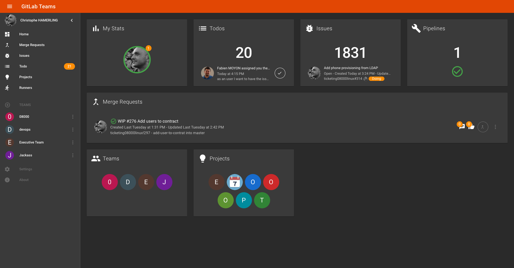

# gitlab-teams

[](https://travis-ci.com/chamerling/gitlab-teams)
[](https://gitlab-teams.netlify.com)

View your defined Gitlab teams Merge Requests live-updated without effort i.e. the missing thing from Gitlab.

This project is only a frontend app based on Vue and RxJS. This is still a WIP: No error handling, no tests, etc, but it works pretty well for now.

At startup, you will be asked to fill a form with your `Personal Access Token` and a `GitLab URL` in the settings page:

- `Personal Access Token` is the one you can get from your Gitlab instance under `/profile/personal_access_tokens`. Create a new one with at least `api` and `read_user` scopes.
- `Gitlab URL` is... your Gitlab instance URL. It is used to build the API endpoints to call.

These two settings are stored in your browser local storage and **are never sent to someone else than your Gitlab instance**.

Once set, you will be able to create and navigate in your teams like a boss 💪. Merge requests will update automatically, and also pipelines, issues, todos, etc



## Project setup
```
npm install
```

### Compiles and hot-reloads for development
```
npm run serve
```

### Compiles and minifies for production
```
npm run build
```

### Lints and fixes files
```
npm run lint
```

### Docker

Docker image is built on commit and available on Docker Hub.

```sh
docker run -it -p 8888:80 --rm --name gitlab-teams chamerling/gitlab-teams
```

Then open http://localhost:8888 and enjoy.

## License

MIT
